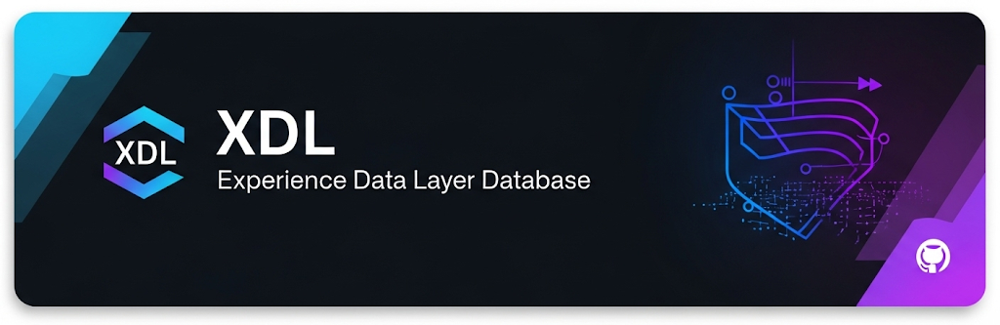

# Azure SQL Development Environment (XDL)

[](VERSION-HISTORY.md) 🧪

🚀 **Complete Azure SQL Database development and administration environment with cognitive memory architecture**

## 📋 Overview

This repository contains a comprehensive development environment for Azure SQL Database operations, featuring:

- **Azure MFA Authentication** for secure database connections
- **Cognitive Memory Architecture** for self-learning database operations
- **PowerShell Management Scripts** for database administration
- **VS Code Integration** with SQL Server extension
- **Database Documentation** and diagramming tools
- **Performance Monitoring** and optimization utilities

## 🏗️ Environment Status

### Database Configuration
- **Server**: `cxmidl.database.windows.net`
- **Database**: `Orchestration`
- **Authentication**: Azure MFA (Active Directory Interactive)
- **Resource Group**: `CPMQualtricsResourceGroup`
- **Subscription**: `f6ab5f6d-606a-4256-aba7-1feeeb53784f`

### Version Information
- **Current Version**: [](VERSION-HISTORY.md)
- **Versioning Scheme**: Periodic Table Elements (X.Y.Z = Element #XYZ)
- **Release Date**: July 14, 2025
- **Version Notes**: Initial release with complete Azure SQL development environment

### Setup Completion
- ✅ Directory structure (26+ specialized folders)
- ✅ Azure MFA authentication configuration
- ✅ PowerShell management scripts
- ✅ VS Code SQL Server extension setup
- ✅ Cognitive memory architecture implementation
- ✅ Database diagramming tools
- ✅ Git repository initialization

## 🛠️ Quick Start

### 1. Test Database Connection
```powershell
.\tools\powershell\Test-AzureSqlMFA.ps1
```

### 2. Explore Database Structure
```powershell
.\tools\powershell\Get-DatabaseTables.ps1
```

### 3. Create/Update Database Diagram
```powershell
.\tools\powershell\Create-DatabaseDiagram.ps1
```

### 4. Open in VS Code
- Use the configured "Orchestration-MFA" connection profile
- Browse database objects directly in VS Code
- Run queries with IntelliSense support

## 📁 Repository Structure

```
c:\Development\XDL\
├── .github\                          # Cognitive memory architecture
│   ├── copilot-instructions.md       # Global memory coordination
│   ├── instructions\                 # Procedural memory (11 files)
│   └── prompts\                      # Episodic memory (15+ files)
├── documentation\                    # Database documentation
│   ├── database-design\              # ERD diagrams and design docs
│   ├── performance\                  # Performance analysis
│   └── security\                     # Security documentation
├── sql\                             # SQL scripts and queries
│   ├── procedures\                  # Stored procedures
│   ├── functions\                   # User-defined functions
│   ├── views\                       # Database views
│   └── monitoring\                  # Monitoring queries
├── tools\                           # Development and admin tools
│   ├── powershell\                  # PowerShell management scripts
│   └── migration\                   # Database migration tools
└── config\                          # Configuration files
    ├── environments\                # Environment-specific configs
    └── templates\                   # Configuration templates
```

## 🧠 Cognitive Memory Architecture

This environment features an advanced cognitive memory system:

### Working Memory (Active Rules)
- **@security** - Comprehensive security measures
- **@performance** - Database optimization strategies  
- **@meditation** - Auto-consolidation triggers
- **@reliability** - High availability and disaster recovery

### Procedural Memory (Skills)
- Azure SQL best practices
- Database development patterns
- Performance tuning techniques
- Security management protocols
- Backup and recovery strategies

### Episodic Memory (Workflows)
- Database design procedures
- Query optimization workflows
- Security audit processes
- Performance analysis methods
- Migration assessment protocols

## 🔧 Tools & Scripts

### PowerShell Management
- `Test-AzureSqlMFA.ps1` - Test MFA connection
- `Get-DatabaseTables.ps1` - List database tables
- `Manage-AzureSqlDatabase-MFA.ps1` - Full database management
- `Create-DatabaseDiagram.ps1` - Generate ER diagrams

### VS Code Integration
- SQL Server extension with MFA profile
- IntelliSense for SQL queries
- Database object explorer
- Query execution and results

### Documentation Tools
- Automated database diagramming
- Performance monitoring queries
- Security audit scripts
- Migration planning templates

## 🔐 Security Features

- **Azure MFA Integration** - Multi-factor authentication required
- **Connection String Security** - Credentials stored in environment variables
- **Access Control Documentation** - Role-based security guidelines
- **Audit Trail Support** - Comprehensive logging capabilities

## 📊 Database Diagram

The repository includes a comprehensive Entity Relationship Diagram of the Orchestration database:
- **Location**: `documentation/database-design/orchestration-database-diagram.md`
- **Format**: Mermaid ERD with full relationship mapping
- **Entities**: 11 core orchestration tables
- **Auto-Update**: Script can refresh from live database

## 🚀 Getting Started

1. **Prerequisites**:
   - PowerShell 7+
   - Azure PowerShell modules
   - VS Code with SQL Server extension
   - Git (for version control)

2. **Initial Setup**:
   ```powershell
   # Test Azure connection
   Connect-AzAccount
   
   # Test database connection
   .\tools\powershell\Test-AzureSqlMFA.ps1
   
   # Generate database documentation
   .\tools\powershell\Create-DatabaseDiagram.ps1
   ```

3. **Development Workflow**:
   - Use VS Code for query development
   - Commit SQL scripts to version control
   - Document changes in appropriate folders
   - Update diagrams when schema changes

## 📚 Documentation

- **Setup Guide**: `SETUP-AZURE-SQL.md`
- **MFA Configuration**: `AZURE-SQL-MFA-SETUP-COMPLETE.md`
- **Database Design**: `documentation/database-design/README.md`
- **Cognitive Architecture**: `.github/copilot-instructions.md`

## 🤝 Contributing

This environment uses a self-learning cognitive architecture that automatically improves over time. When adding new scripts or documentation:

1. Follow the established folder structure
2. Update relevant documentation
3. Test all scripts before committing
4. Use descriptive commit messages

## 📝 License

Internal development environment - Microsoft Azure SQL Database

---

**Last Updated**: July 14, 2025  
**Environment**: Azure SQL Database with MFA  
**Cognitive Status**: Fully operational with self-learning capabilities  
**Repository Status**: Active development with version control
