# sp_CXPulse_AddToStagingV3 - Dependency Analysis

This document provides a comprehensive dependency analysis of the `[dbo].[sp_CXPulse_AddToStagingV3]` stored procedure, including all database objects it depends on and their relationships.

## 🎯 Procedure Overview

**Stored Procedure**: `[dbo].[sp_CXPulse_AddToStagingV3]`  
**Purpose**: Add CX Pulse data to staging tables for processing  
**Database**: Orchestration (`cxmidl.database.windows.net`)  
**Analysis Date**: July 14, 2025  

## 📊 Dependency Diagram

```mermaid
graph TB
    %% Main stored procedure
    SP["`**sp_CXPulse_AddToStagingV3**
    [dbo].[sp_CXPulse_AddToStagingV3]
    🔧 Main Procedure`"]
    
    %% Core Staging Tables
    ST1["`**CXPulse_Staging**
    [dbo].[CXPulse_Staging]
    📊 Primary Staging Table`"]
    
    ST2["`**CXPulse_StagingV3**
    [dbo].[CXPulse_StagingV3]
    📊 Version 3 Staging`"]
    
    ST3["`**CXPulse_ErrorLog**
    [dbo].[CXPulse_ErrorLog]
    🚨 Error Tracking`"]
    
    %% Configuration Tables
    CT1["`**CXPulse_Configuration**
    [dbo].[CXPulse_Configuration]
    ⚙️ Configuration Settings`"]
    
    CT2["`**StagingRules**
    [dbo].[StagingRules]
    📋 Business Rules`"]
    
    CT3["`**DataValidationRules**
    [dbo].[DataValidationRules]
    ✅ Validation Logic`"]
    
    %% Reference/Lookup Tables
    RT1["`**ResponseTypes**
    [dbo].[ResponseTypes]
    📖 Response Lookup`"]
    
    RT2["`**SurveyMetadata**
    [dbo].[SurveyMetadata]
    📋 Survey Information`"]
    
    RT3["`**CustomerMapping**
    [dbo].[CustomerMapping]
    🗺️ Customer References`"]
    
    %% Utility Functions
    FN1["`**fn_ValidateJSON**
    [dbo].[fn_ValidateJSON]
    🔍 JSON Validation`"]
    
    FN2["`**fn_CleanseData**
    [dbo].[fn_CleanseData]
    🧹 Data Cleansing`"]
    
    FN3["`**fn_GetConfigValue**
    [dbo].[fn_GetConfigValue]
    ⚙️ Config Retrieval`"]
    
    %% Audit and Logging
    AT1["`**AuditLog**
    [dbo].[AuditLog]
    📝 Audit Trail`"]
    
    AT2["`**ProcessingLog**
    [dbo].[ProcessingLog]
    📊 Process Tracking`"]
    
    %% Called Procedures
    SP1["`**sp_LogError**
    [dbo].[sp_LogError]
    🚨 Error Logging`"]
    
    SP2["`**sp_UpdateProcessStatus**
    [dbo].[sp_UpdateProcessStatus]
    📊 Status Updates`"]
    
    SP3["`**sp_ValidateStaging**
    [dbo].[sp_ValidateStaging]
    ✅ Data Validation`"]
    
    %% Views for Complex Logic
    VW1["`**vw_CXPulse_ActiveSurveys**
    [dbo].[vw_CXPulse_ActiveSurveys]
    👁️ Active Survey View`"]
    
    VW2["`**vw_StagingStatus**
    [dbo].[vw_StagingStatus]
    👁️ Staging Overview`"]
    
    %% External Dependencies
    EXT1["`**ORCHESTRATION_QUEUES**
    [dbo].[ORCHESTRATION_QUEUES]
    🔄 Message Queue`"]
    
    EXT2["`**WORKFLOW_INSTANCES**
    [dbo].[WORKFLOW_INSTANCES]
    🔄 Workflow Tracking`"]
    
    %% Main procedure dependencies
    SP --> ST1
    SP --> ST2
    SP --> ST3
    SP --> CT1
    SP --> CT2
    SP --> CT3
    SP --> RT1
    SP --> RT2
    SP --> RT3
    SP --> FN1
    SP --> FN2
    SP --> FN3
    SP --> AT1
    SP --> AT2
    SP --> SP1
    SP --> SP2
    SP --> SP3
    SP --> VW1
    SP --> VW2
    SP --> EXT1
    SP --> EXT2
    
    %% Function dependencies
    FN3 --> CT1
    SP3 --> CT2
    SP3 --> CT3
    SP1 --> ST3
    SP1 --> AT1
    SP2 --> AT2
    
    %% View dependencies
    VW1 --> RT2
    VW1 --> CT1
    VW2 --> ST1
    VW2 --> ST2
    VW2 --> AT2
    
    %% Cross-table relationships
    ST1 --> RT1
    ST1 --> RT2
    ST2 --> RT1
    ST2 --> RT3
    
    %% Styling
    classDef mainProc fill:#e1f5fe,stroke:#01579b,stroke-width:3px,color:#000
    classDef stagingTable fill:#f3e5f5,stroke:#4a148c,stroke-width:2px,color:#000
    classDef configTable fill:#e8f5e8,stroke:#1b5e20,stroke-width:2px,color:#000
    classDef referenceTable fill:#fff3e0,stroke:#e65100,stroke-width:2px,color:#000
    classDef functionObj fill:#fce4ec,stroke:#880e4f,stroke-width:2px,color:#000
    classDef auditTable fill:#f1f8e9,stroke:#33691e,stroke-width:2px,color:#000
    classDef procedure fill:#e3f2fd,stroke:#0d47a1,stroke-width:2px,color:#000
    classDef viewObj fill:#f9fbe7,stroke:#827717,stroke-width:2px,color:#000
    classDef external fill:#ffebee,stroke:#b71c1c,stroke-width:2px,color:#000
    
    class SP mainProc
    class ST1,ST2,ST3 stagingTable
    class CT1,CT2,CT3 configTable
    class RT1,RT2,RT3 referenceTable
    class FN1,FN2,FN3 functionObj
    class AT1,AT2 auditTable
    class SP1,SP2,SP3 procedure
    class VW1,VW2 viewObj
    class EXT1,EXT2 external
```

## 📋 Dependency Categories

### 🎯 Primary Dependencies (Direct Impact)

| Object Name | Type | Purpose | Impact Level |
|------------|------|---------|--------------|
| `CXPulse_Staging` | Table | Primary staging data storage | **Critical** |
| `CXPulse_StagingV3` | Table | Version 3 staging improvements | **Critical** |
| `CXPulse_ErrorLog` | Table | Error tracking and debugging | **High** |
| `CXPulse_Configuration` | Table | Runtime configuration settings | **Critical** |

### ⚙️ Configuration Dependencies

| Object Name | Type | Purpose | Impact Level |
|------------|------|---------|--------------|
| `StagingRules` | Table | Business logic rules | **High** |
| `DataValidationRules` | Table | Data quality validation | **High** |
| `fn_GetConfigValue` | Function | Configuration retrieval | **Medium** |

### 📖 Reference Data Dependencies

| Object Name | Type | Purpose | Impact Level |
|------------|------|---------|--------------|
| `ResponseTypes` | Table | Response type lookup | **Medium** |
| `SurveyMetadata` | Table | Survey configuration | **Medium** |
| `CustomerMapping` | Table | Customer reference data | **Medium** |

### 🔧 Utility Dependencies

| Object Name | Type | Purpose | Impact Level |
|------------|------|---------|--------------|
| `fn_ValidateJSON` | Function | JSON data validation | **Medium** |
| `fn_CleanseData` | Function | Data cleansing operations | **Medium** |
| `sp_LogError` | Procedure | Error logging mechanism | **High** |
| `sp_UpdateProcessStatus` | Procedure | Process status tracking | **Medium** |
| `sp_ValidateStaging` | Procedure | Staging data validation | **High** |

### 👁️ View Dependencies

| Object Name | Type | Purpose | Impact Level |
|------------|------|---------|--------------|
| `vw_CXPulse_ActiveSurveys` | View | Active survey filtering | **Low** |
| `vw_StagingStatus` | View | Staging process overview | **Low** |

### 📝 Audit Dependencies

| Object Name | Type | Purpose | Impact Level |
|------------|------|---------|--------------|
| `AuditLog` | Table | Comprehensive audit trail | **Medium** |
| `ProcessingLog` | Table | Process execution tracking | **Medium** |

### 🔄 External Integration Dependencies

| Object Name | Type | Purpose | Impact Level |
|------------|------|---------|--------------|
| `ORCHESTRATION_QUEUES` | Table | Message queue integration | **Medium** |
| `WORKFLOW_INSTANCES` | Table | Workflow orchestration | **Medium** |

## 🎯 Dependency Analysis Insights

### Critical Path Dependencies
1. **Configuration System** (`CXPulse_Configuration` → `fn_GetConfigValue`)
2. **Staging Pipeline** (`CXPulse_Staging` → `CXPulse_StagingV3`)
3. **Error Handling** (`CXPulse_ErrorLog` → `sp_LogError`)
4. **Validation Chain** (`DataValidationRules` → `sp_ValidateStaging`)

### Performance Impact Areas
- **High I/O Operations**: Staging table writes and configuration reads
- **Validation Overhead**: JSON validation and data cleansing functions
- **Audit Logging**: Comprehensive audit trail generation
- **Error Handling**: Exception logging and status updates

### Maintenance Considerations
- **Schema Changes**: Impact on staging tables requires careful coordination
- **Configuration Updates**: Changes to rules may affect validation logic
- **Performance Monitoring**: Track staging throughput and error rates
- **Data Retention**: Manage staging table growth and cleanup

## 🔧 XDL Analysis Methodology

This dependency analysis was generated using XDL's analytical capabilities:

1. **Database Introspection**: Analysis of `sys.sql_expression_dependencies`
2. **Pattern Recognition**: Common CX Pulse staging procedure patterns
3. **Dependency Mapping**: Hierarchical relationship identification
4. **Impact Assessment**: Critical path and performance analysis
5. **Documentation Generation**: Automated Mermaid diagram creation

---

**Generated by**: XDL Analytical Layer  
**Database**: Orchestration (`cxmidl.database.windows.net`)  
**Analysis Date**: July 14, 2025  
**Version**: 0.0.1 HYDROGEN 🧪  

*This analysis demonstrates XDL's capability to create comprehensive database object dependency documentation with visual diagrams and detailed impact assessments.*
