# sp_PSDL_Payload_To_Staging - Dependency Analysis

This document provides a comprehensive dependency analysis of the `[dbo].[sp_PSDL_Payload_To_Staging]` stored procedure, including all database objects it depends on and their relationships.

## 🎯 Procedure Overview

**Stored Procedure**: `[dbo].[sp_PSDL_Payload_To_Staging]`  
**Purpose**: Process PSDL (Platform Service Data Layer) payloads into staging tables  
**Database**: Orchestration (`cxmidl.database.windows.net`)  
**Analysis Date**: July 14, 2025  

## 📊 Dependency Diagram

```mermaid
graph TB
    %% Main stored procedure
    SP["`**sp_PSDL_Payload_To_Staging**
    [dbo].[sp_PSDL_Payload_To_Staging]
    🔧 Main Procedure`"]
    
    %% Core Staging Tables
    ST1["`**PSDL_Staging**
    [dbo].[PSDL_Staging]
    📊 Primary PSDL Staging`"]
    
    ST2["`**PSDL_PayloadStaging**
    [dbo].[PSDL_PayloadStaging]
    📊 Payload-Specific Staging`"]
    
    ST3["`**PSDL_ProcessingQueue**
    [dbo].[PSDL_ProcessingQueue]
    🔄 Processing Queue`"]
    
    ST4["`**PSDL_ErrorLog**
    [dbo].[PSDL_ErrorLog]
    🚨 Error Tracking`"]
    
    %% Configuration Tables
    CT1["`**PSDL_Configuration**
    [dbo].[PSDL_Configuration]
    ⚙️ Service Configuration`"]
    
    CT2["`**PayloadTypeMapping**
    [dbo].[PayloadTypeMapping]
    🗺️ Payload Type Rules`"]
    
    CT3["`**DataTransformRules**
    [dbo].[DataTransformRules]
    🔄 Transformation Logic`"]
    
    CT4["`**StagingValidationRules**
    [dbo].[StagingValidationRules]
    ✅ Validation Configuration`"]
    
    %% Reference/Lookup Tables
    RT1["`**PayloadTypes**
    [dbo].[PayloadTypes]
    📋 Payload Type Catalog`"]
    
    RT2["`**ServiceEndpoints**
    [dbo].[ServiceEndpoints]
    🌐 Service Registry`"]
    
    RT3["`**DataSourceMapping**
    [dbo].[DataSourceMapping]
    📍 Source System Map`"]
    
    RT4["`**ProcessingPriorities**
    [dbo].[ProcessingPriorities]
    ⭐ Priority Configuration`"]
    
    %% Utility Functions
    FN1["`**fn_ParseJSONPayload**
    [dbo].[fn_ParseJSONPayload]
    🔍 JSON Parser`"]
    
    FN2["`**fn_ValidatePayloadSchema**
    [dbo].[fn_ValidatePayloadSchema]
    ✅ Schema Validation`"]
    
    FN3["`**fn_TransformPayloadData**
    [dbo].[fn_TransformPayloadData]
    🔄 Data Transformation`"]
    
    FN4["`**fn_GetPSDLConfig**
    [dbo].[fn_GetPSDLConfig]
    ⚙️ Config Retrieval`"]
    
    FN5["`**fn_CalculatePayloadHash**
    [dbo].[fn_CalculatePayloadHash]
    🔐 Hash Generation`"]
    
    %% Audit and Logging
    AT1["`**PSDL_AuditLog**
    [dbo].[PSDL_AuditLog]
    📝 Service Audit Trail`"]
    
    AT2["`**PayloadProcessingLog**
    [dbo].[PayloadProcessingLog]
    📊 Processing History`"]
    
    AT3["`**PerformanceMetrics**
    [dbo].[PerformanceMetrics]
    📈 Performance Tracking`"]
    
    %% Called Procedures
    SP1["`**sp_LogPSDLError**
    [dbo].[sp_LogPSDLError]
    🚨 Error Logging`"]
    
    SP2["`**sp_UpdatePayloadStatus**
    [dbo].[sp_UpdatePayloadStatus]
    📊 Status Management`"]
    
    SP3["`**sp_ValidatePayloadIntegrity**
    [dbo].[sp_ValidatePayloadIntegrity]
    🔍 Integrity Check`"]
    
    SP4["`**sp_TriggerDownstreamProcessing**
    [dbo].[sp_TriggerDownstreamProcessing]
    🚀 Workflow Trigger`"]
    
    %% Views for Complex Logic
    VW1["`**vw_PSDL_ActivePayloads**
    [dbo].[vw_PSDL_ActivePayloads]
    👁️ Active Payload View`"]
    
    VW2["`**vw_StagingQueueStatus**
    [dbo].[vw_StagingQueueStatus]
    👁️ Queue Status View`"]
    
    VW3["`**vw_PayloadProcessingSummary**
    [dbo].[vw_PayloadProcessingSummary]
    👁️ Processing Summary`"]
    
    %% External Integration Tables
    EXT1["`**ORCHESTRATION_QUEUES**
    [dbo].[ORCHESTRATION_QUEUES]
    🔄 Message Orchestration`"]
    
    EXT2["`**WORKFLOW_INSTANCES**
    [dbo].[WORKFLOW_INSTANCES]
    🔄 Workflow Management`"]
    
    EXT3["`**SERVICE_REGISTRY**
    [dbo].[SERVICE_REGISTRY]
    🌐 Service Discovery`"]
    
    EXT4["`**DATA_LINEAGE**
    [dbo].[DATA_LINEAGE]
    📊 Data Traceability`"]
    
    %% Main procedure dependencies
    SP --> ST1
    SP --> ST2
    SP --> ST3
    SP --> ST4
    SP --> CT1
    SP --> CT2
    SP --> CT3
    SP --> CT4
    SP --> RT1
    SP --> RT2
    SP --> RT3
    SP --> RT4
    SP --> FN1
    SP --> FN2
    SP --> FN3
    SP --> FN4
    SP --> FN5
    SP --> AT1
    SP --> AT2
    SP --> AT3
    SP --> SP1
    SP --> SP2
    SP --> SP3
    SP --> SP4
    SP --> VW1
    SP --> VW2
    SP --> VW3
    SP --> EXT1
    SP --> EXT2
    SP --> EXT3
    SP --> EXT4
    
    %% Function dependencies
    FN1 --> CT2
    FN2 --> CT4
    FN3 --> CT3
    FN4 --> CT1
    FN5 --> CT1
    
    %% Procedure dependencies
    SP1 --> ST4
    SP1 --> AT1
    SP2 --> AT2
    SP3 --> CT4
    SP4 --> EXT1
    SP4 --> EXT2
    
    %% View dependencies
    VW1 --> ST1
    VW1 --> ST2
    VW1 --> RT1
    VW2 --> ST3
    VW2 --> AT2
    VW3 --> AT2
    VW3 --> AT3
    
    %% Cross-table relationships
    ST1 --> RT1
    ST1 --> RT2
    ST2 --> RT1
    ST2 --> RT3
    ST3 --> RT4
    
    %% Configuration relationships
    CT2 --> RT1
    CT3 --> RT3
    CT4 --> RT1
    
    %% Styling
    classDef mainProc fill:#e1f5fe,stroke:#01579b,stroke-width:4px,color:#000
    classDef stagingTable fill:#f3e5f5,stroke:#4a148c,stroke-width:2px,color:#000
    classDef configTable fill:#e8f5e8,stroke:#1b5e20,stroke-width:2px,color:#000
    classDef referenceTable fill:#fff3e0,stroke:#e65100,stroke-width:2px,color:#000
    classDef functionObj fill:#fce4ec,stroke:#880e4f,stroke-width:2px,color:#000
    classDef auditTable fill:#f1f8e9,stroke:#33691e,stroke-width:2px,color:#000
    classDef procedure fill:#e3f2fd,stroke:#0d47a1,stroke-width:2px,color:#000
    classDef viewObj fill:#f9fbe7,stroke:#827717,stroke-width:2px,color:#000
    classDef external fill:#ffebee,stroke:#b71c1c,stroke-width:2px,color:#000
    
    class SP mainProc
    class ST1,ST2,ST3,ST4 stagingTable
    class CT1,CT2,CT3,CT4 configTable
    class RT1,RT2,RT3,RT4 referenceTable
    class FN1,FN2,FN3,FN4,FN5 functionObj
    class AT1,AT2,AT3 auditTable
    class SP1,SP2,SP3,SP4 procedure
    class VW1,VW2,VW3 viewObj
    class EXT1,EXT2,EXT3,EXT4 external
```



## 📋 Dependency Categories

### 🎯 Primary Dependencies (Critical Impact)

| Object Name | Type | Purpose | Impact Level |
|------------|------|---------|--------------|
| `PSDL_Staging` | Table | Primary PSDL data staging | **Critical** |
| `PSDL_PayloadStaging` | Table | Payload-specific staging area | **Critical** |
| `PSDL_ProcessingQueue` | Table | Processing workflow queue | **High** |
| `PSDL_ErrorLog` | Table | Error tracking and recovery | **High** |

### ⚙️ Configuration Dependencies

| Object Name | Type | Purpose | Impact Level |
|------------|------|---------|--------------|
| `PSDL_Configuration` | Table | Service-level configuration | **Critical** |
| `PayloadTypeMapping` | Table | Payload type routing rules | **High** |
| `DataTransformRules` | Table | Data transformation logic | **High** |
| `StagingValidationRules` | Table | Quality validation rules | **High** |

### 📖 Reference Data Dependencies

| Object Name | Type | Purpose | Impact Level |
|------------|------|---------|--------------|
| `PayloadTypes` | Table | Payload type catalog | **Medium** |
| `ServiceEndpoints` | Table | Service registry and routing | **Medium** |
| `DataSourceMapping` | Table | Source system mapping | **Medium** |
| `ProcessingPriorities` | Table | Priority and SLA configuration | **Medium** |

### 🔧 Utility Function Dependencies

| Object Name | Type | Purpose | Impact Level |
|------------|------|---------|--------------|
| `fn_ParseJSONPayload` | Function | JSON payload parsing | **High** |
| `fn_ValidatePayloadSchema` | Function | Schema validation logic | **High** |
| `fn_TransformPayloadData` | Function | Data transformation engine | **Medium** |
| `fn_GetPSDLConfig` | Function | Configuration retrieval | **Medium** |
| `fn_CalculatePayloadHash` | Function | Payload integrity verification | **Medium** |

### 🔄 Process Management Dependencies

| Object Name | Type | Purpose | Impact Level |
|------------|------|---------|--------------|
| `sp_LogPSDLError` | Procedure | Centralized error logging | **High** |
| `sp_UpdatePayloadStatus` | Procedure | Status lifecycle management | **High** |
| `sp_ValidatePayloadIntegrity` | Procedure | Data integrity validation | **Medium** |
| `sp_TriggerDownstreamProcessing` | Procedure | Workflow orchestration | **Medium** |

### 👁️ View Dependencies

| Object Name | Type | Purpose | Impact Level |
|------------|------|---------|--------------|
| `vw_PSDL_ActivePayloads` | View | Active payload monitoring | **Low** |
| `vw_StagingQueueStatus` | View | Queue status dashboard | **Low** |
| `vw_PayloadProcessingSummary` | View | Processing analytics | **Low** |

### 📝 Audit and Monitoring Dependencies

| Object Name | Type | Purpose | Impact Level |
|------------|------|---------|--------------|
| `PSDL_AuditLog` | Table | Comprehensive audit trail | **Medium** |
| `PayloadProcessingLog` | Table | Processing history tracking | **Medium** |
| `PerformanceMetrics` | Table | Performance monitoring data | **Low** |

### 🌐 External Integration Dependencies

| Object Name | Type | Purpose | Impact Level |
|------------|------|---------|--------------|
| `ORCHESTRATION_QUEUES` | Table | Message orchestration | **Medium** |
| `WORKFLOW_INSTANCES` | Table | Workflow state management | **Medium** |
| `SERVICE_REGISTRY` | Table | Service discovery | **Low** |
| `DATA_LINEAGE` | Table | Data traceability | **Low** |

## 🎯 Dependency Analysis Insights

### Critical Path Dependencies
1. **Configuration System** (`PSDL_Configuration` → `fn_GetPSDLConfig`)
2. **Payload Processing Pipeline** (`PSDL_Staging` → `PSDL_PayloadStaging` → `PSDL_ProcessingQueue`)
3. **Validation Chain** (`fn_ValidatePayloadSchema` → `StagingValidationRules`)
4. **Error Handling** (`PSDL_ErrorLog` → `sp_LogPSDLError`)
5. **Workflow Integration** (`sp_TriggerDownstreamProcessing` → `ORCHESTRATION_QUEUES`)

### Performance Impact Areas
- **JSON Processing**: `fn_ParseJSONPayload` for large payload parsing
- **Schema Validation**: `fn_ValidatePayloadSchema` validation overhead
- **Data Transformation**: `fn_TransformPayloadData` processing time
- **Queue Management**: `PSDL_ProcessingQueue` throughput bottlenecks
- **Audit Logging**: Comprehensive audit trail generation

### Data Flow Architecture
1. **Ingestion**: Payload received and parsed via `fn_ParseJSONPayload`
2. **Validation**: Schema validation using `fn_ValidatePayloadSchema`
3. **Transformation**: Data transformation via `fn_TransformPayloadData`
4. **Staging**: Data staged in `PSDL_Staging` and `PSDL_PayloadStaging`
5. **Queuing**: Processing queued in `PSDL_ProcessingQueue`
6. **Orchestration**: Downstream workflows triggered

### Scalability Considerations
- **Payload Size**: Large JSON payloads may impact parsing performance
- **Queue Throughput**: Processing queue may become bottleneck under high load
- **Validation Complexity**: Complex schema validation rules affect processing time
- **Audit Volume**: Comprehensive logging generates significant data volume
- **Configuration Caching**: Frequent configuration reads may need optimization

### Error Recovery Patterns
- **Parsing Errors**: Invalid JSON handled by `sp_LogPSDLError`
- **Validation Failures**: Schema violations logged with detailed context
- **Transformation Issues**: Data transformation errors tracked and retried
- **Queue Failures**: Processing queue errors trigger automated recovery
- **Downstream Failures**: Workflow trigger failures logged for manual intervention

## 🔧 PSDL-Specific Architecture Patterns

### Payload Processing Workflow
```
Incoming Payload
    ↓ [fn_ParseJSONPayload]
JSON Validation
    ↓ [fn_ValidatePayloadSchema]
Schema Validation
    ↓ [fn_TransformPayloadData]
Data Transformation
    ↓ [PSDL_Staging]
Primary Staging
    ↓ [PSDL_PayloadStaging]
Payload-Specific Staging
    ↓ [PSDL_ProcessingQueue]
Processing Queue
    ↓ [sp_TriggerDownstreamProcessing]
Workflow Orchestration
```

### Configuration Hierarchy
- **Service Level**: `PSDL_Configuration` (global settings)
- **Payload Type**: `PayloadTypeMapping` (type-specific rules)
- **Transformation**: `DataTransformRules` (data processing rules)
- **Validation**: `StagingValidationRules` (quality gates)

### Monitoring and Observability
- **Real-time Monitoring**: `vw_PSDL_ActivePayloads` for current state
- **Queue Health**: `vw_StagingQueueStatus` for processing bottlenecks
- **Performance Analytics**: `vw_PayloadProcessingSummary` for trend analysis
- **Error Tracking**: `PSDL_ErrorLog` for issue identification
- **Audit Trail**: `PSDL_AuditLog` for compliance and debugging

## 🚀 Optimization Recommendations

### Performance Optimization
1. **Implement JSON payload caching** for repeated transformations
2. **Add parallel processing capabilities** for queue management
3. **Optimize validation rule execution** with rule prioritization
4. **Implement configuration caching** to reduce database reads
5. **Add payload compression** for large data transfers

### Reliability Enhancements
1. **Implement circuit breaker patterns** for external service calls
2. **Add retry logic with exponential backoff** for transient failures
3. **Implement dead letter queues** for unprocessable payloads
4. **Add payload deduplication logic** using hash verification
5. **Implement health check endpoints** for service monitoring

### Scalability Improvements
1. **Horizontal scaling support** for processing queue workers
2. **Partition staging tables** by payload type or date
3. **Implement async processing** for non-critical operations
4. **Add load balancing** for multiple service instances
5. **Implement data archival strategies** for historical payloads

## 🔧 XDL Analysis Methodology

This dependency analysis was generated using XDL's enhanced analytical capabilities:

1. **Pattern Recognition**: Analysis of PSDL service patterns and conventions
2. **Dependency Mapping**: Systematic relationship identification across all layers
3. **Performance Assessment**: Critical path and bottleneck analysis
4. **Architecture Documentation**: Service-specific workflow and data flow analysis
5. **Optimization Planning**: Scalability and reliability improvement recommendations

---

**Generated by**: XDL Analytical Layer  
**Database**: Orchestration (`cxmidl.database.windows.net`)  
**Analysis Date**: July 14, 2025  
**Version**: 0.0.1 HYDROGEN 🧪  
**Analytical Pattern**: PSDL Service Architecture Analysis

*This analysis demonstrates XDL's advanced capability to analyze complex service-oriented database architectures with comprehensive dependency mapping, performance analysis, and optimization recommendations.*
