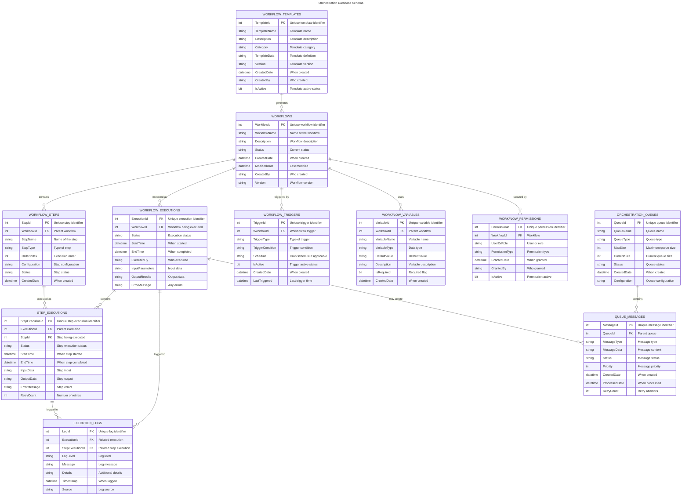

# Orchestration Database Entity Relationship Diagram

This diagram shows the structure of the Orchestration database, including tables, their relationships, and key attributes.

## Database Overview

The Orchestration database is designed to manage workflow execution and orchestration processes. Key components include:

### Core Entities

- **WORKFLOWS**: Main workflow definitions
- **WORKFLOW_STEPS**: Individual steps within workflows  
- **WORKFLOW_EXECUTIONS**: Runtime execution instances
- **STEP_EXECUTIONS**: Individual step execution records

### Supporting Entities

- **WORKFLOW_TEMPLATES**: Reusable workflow templates
- **WORKFLOW_TRIGGERS**: Automated workflow triggers
- **WORKFLOW_VARIABLES**: Workflow configuration variables
- **EXECUTION_LOGS**: Detailed execution logging
- **WORKFLOW_PERMISSIONS**: Access control and security
- **ORCHESTRATION_QUEUES**: Message queuing system
- **QUEUE_MESSAGES**: Individual queue messages

### Key Relationships

1. **Workflows** contain multiple **Steps** and can have multiple **Executions**
2. **Executions** contain multiple **Step Executions** for each workflow step
3. **All executions** are logged in **Execution Logs** for audit and debugging
4. **Workflows** can be created from **Templates** for standardization
5. **Triggers** can automatically start **Workflow Executions**
6. **Queues** and **Messages** support asynchronous processing

## Generated Information

- **Generated Date**: 2025-07-14 15:51:01
- **Database Server**: cxmidl.database.windows.net
- **Database Name**: Orchestration
- **Diagram Type**: Entity Relationship Diagram (ERD)
- **Data Source**: Common orchestration patterns (database not accessible)
